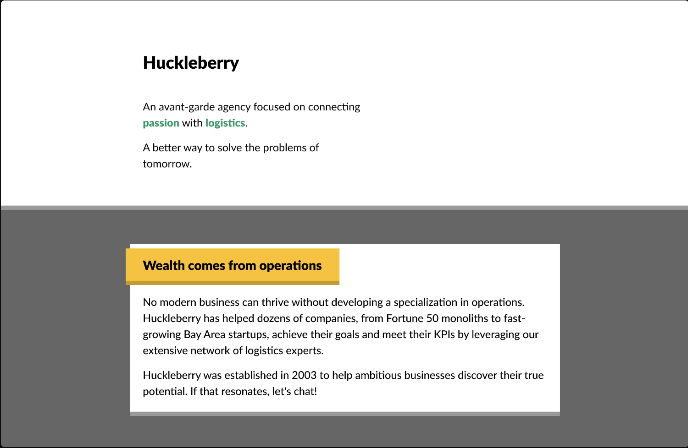
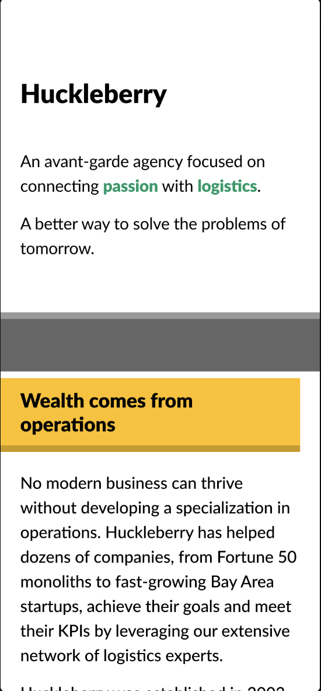

## Workshop 1: Agency Page

The goal of this workshop is to build an Agency landing page. This is how it looks
- **On Desktop**: 
    
- **On Tablet**:
    
- **On Mobile**:
    

This looks simple but the challenge is to build it using only the Flow Layout (the default layout of CSS), margin, padding and border. CSS Media queries are also forbiden. This challenge is taken from [Josh W. Comeau's CSS For Javascript Developer Course](https://css-for-js.dev/).